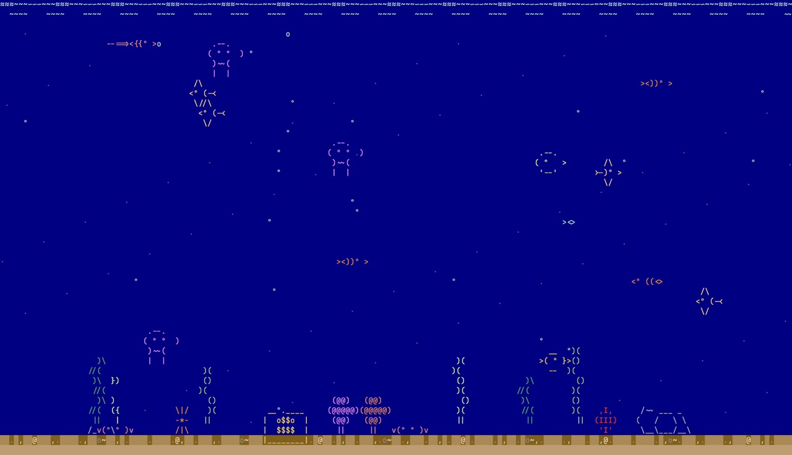

# Shellquarium 🐠

An ASCII tropical fish aquarium that runs in your terminal.

<p align="center">
  
</p>

Features:
- 8 fish species (neon tetra, clownfish, angelfish, pufferfish, betta, swordtail, jellyfish, goldfish)
- Animated waves, rising bubbles, swaying seaweed
- Crabs scuttling on the sand, starfish, rocks, and a treasure chest
- 256-color ANSI with deep-water background
- Responds to terminal resize

## Quick Start

Run without cloning:

```sh
curl -sL https://raw.githubusercontent.com/richstokes/shellquarium/main/main.go -o /tmp/sq.go && go run /tmp/sq.go
```

## Build & Run

```sh
go build -o shellquarium .
./shellquarium
```

Or run directly:

```sh
go run .
```

## Controls

- **R** — randomize/reload the scene
- **Q** or **Ctrl+C** — exit

## Requirements

- Go 1.18+
- A terminal that supports 256 colors (most modern terminals)
- Minimum terminal size: 40×15
